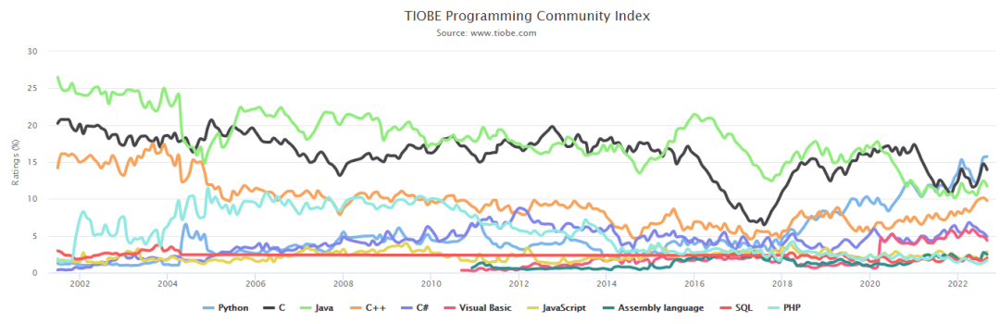

# Python入门最佳实践

## 课程导读
- [X] Python简介
- [X] Python的基本语法
    - [X] Python的6大数据类型
    - [X] Python的面向对象思想
    - [X] Python的控制结构
    - [X] Python的函数
- [X] Python常用三方库介绍
- [X] Python的课程设计
---
- [ ] Python的函数式编程
- [ ] Python的面向对象编程
- [ ] Python的多线程 、多进程
- [ ] Python的网络编程
- [ ] Python的语法糖

## 开启妙不可言的Python之旅
### 1. 认识Python(了解)
#### 1.1 Python的起源

- 1989年，为了***打发***无聊的圣诞节假期，Gudio van Rossum吉多· 范罗苏姆（龟叔）决心开发一个新的解释程序（Python雏形）,在MacBook上一夜完成。

    

- Python这个名字，来自龟叔所挚爱的电视剧Monty Python's Flying Circus

    

- Python的logo

    

- 经过20余年的发展，Python目前已经是第一大编程语言

    
    

#### 1.2 Python的魅力何在？

- 一种编程语言为什么会流行？
    - 主要原因：应用广泛（有用）、开发效率高 & 易维护（好用）
    - 次要原因：性能优异、暂无竞争对手（垄断）

思考：排名靠前的语言们，它们各自为什么流行？

#### 1.3 什么是Pythonic 的编程思维？
- Python 是工程，不是艺术（解决同一个问题用同一种方法）
    - Python 中的 None 只有一种写法，不能写成 none / null / nul / Null / NONE
    - True/False 也只有一种写法，不能写成 true / TRUE
    - Python 中的分支结构只有 if/else，没有 switch
    - Python 中的 for 循环也只有一种写法 for i in items: ...
- 简单优于复杂
    - Python 只有很少的语法糖，比如装饰器
    - Python 的对象属性设计基本都是可以自圆其说的，包括切片和 range 的开闭区间一致性，装饰器没有黑魔法，for 和 while 中的 else，迭代器的设计，等等。
- 明确优于晦涩（复杂优于难懂，要始终保持代码的易读性，“让易读的代码进行性能优化”远比“让高效的代码变得易读”要容易）

#### 1.4 Python应用领域

- 几乎所有大中型互联网企业都在使用 Python 完成各种各样的工作

    

- python广泛应用于各种领域

    

### 2. 什么是编程语言
#### 2.1 语言&编程语言
##### 2.1.1 语言
- 语言是进行沟通交流的表达方式，使用不同语言的双方需要翻译官
    - 中文
    - 英语
    - 法语

    

- 计算机只懂得二进制语言,因此我和计算机沟通也需要一个翻译官

    - 翻译官只懂得在编程语言和二进制语言之间互转

    

    - 我们就需要掌握自然语言和编程语言之间互转

    

#### 2.2 编程语言的工作原理

- 编程语言要想转换为机器语言，需要编译器或者*解释器*参与执行
    - 解释执行——一行一行代码的翻译，类比同声传译
        - 效率偏低、出错中断
    - 编译执行——一次性翻译所有代码，类比文章翻译
        - 效率较高、提前排查语法错误
- **Python是一个解释型语言**

    

### 3. 什么是Python解释器(Python环境安装)
#### 3.1 官网获取纯净版Python解释器——毛坯房(<font color="red">!不推荐此方式</font>)

- [Python官网](www.python.org)

    

    

- 注意事项

    - 本文描述了纯净版 Python 开发环境的安装和配置过程
    - Python3 只支持 Windows 7 SP1 以上版本
    - 如果是 XP 或者 Win7 RTM，只能安装 Python2

    - 安装 Python，注意勾选 `Add Python to PATH`，如果选 `Install Now` 会安装到个人 Roaming 目录下。若不希望安装到个人 Roaming 目录，可以选下方的 `Customize Installation`

    

    - 如果选了 `Customize Installation`，接着选 `Install for all users`，会默认将 Python 安装到 `C:\Program Files` 目录下

    

    - 选择解除路径长度限制

    

#### 3.2 Anaconda——精装大别墅(开源Python发行版本，自带科学包和依赖项)
- :thumbsup: :thumbsup: :thumbsup: 强烈推荐该方式
- ~~Anaconda官网下载方式， [Anaconda官网](https://www.anaconda.com/products/distribution)~~，不推荐

- Anaconda的官网logo

    

- Anaconda预装的三方库

    

- 推荐这种方式 [清华大学Anaconda开源镜像站](https://mirrors.tuna.tsinghua.edu.cn/anaconda/archive)

- 鼠标拉到最下方，选择最新版本，下载即可。

    

- Anaconda详细安装步骤

    
    
    
    
    
    
    
    
    
    

#### 3.3 验证Python环境安装正常
- **重新**打开一个 CMD 窗口，验证 Python 是否装好，运行命令：
`python --version` 或者 `python -V` 和`pip --version` 或者`pip -V`

    

#### 3.4 配置pip源为清华源

- 在**上一步**的基础上，继续在CMD窗口中输入命令:

  ```shell
  pip config set global.index-url https://pypi.tuna.tsinghua.edu.cn/simple
  ```

  

- **恭喜！**，你已经完成了python运行环境的全部安装。

### 4. 最适合初学者的编辑器Jupyter Notebook
- Jupyter Notebook是基于网页的用于交互计算的应用程序。其可被应用于全过程计算：开发、文档编写、运行代码和展示结果。

    

    - 1. 首先，使用电脑的资源管理器打开想要编写代码的目录，建议一个项目一个文件夹，比如我们在D盘下创建要给code目录，再在里面创建一个test文件夹

    

    - 2.在打开的powershell窗口下，输入`jupyter notebook`以打开jupyter notebook

    

    - 3. 此时，你电脑的默认浏览器会打开一个本地的网址，如图所示

    

    

- 更多Jupyter Notebook的功能，期待你的自行探索

### 5. 第一个Python代码
- 使用Python输出Hello World！

    ```python
    print('Hello World!') # 请注意小括号和引号均为英文模式
    ```
    

    - 第一个小作业，请自行打印输出"我要好好学Python"

### 6.  Python基础语法精讲

#### 6.1 字面量

- 字面量：在代码中，被**写下来**的的固定的值，称之为**字面量**。

- Pyhton中的6大数据类型

  |类型| 描述|说明|
  | ---- |:---- | :--- |
  | 数值(Number)| 整数（int）、 浮点数（float）、 复数（complex）、 布尔值（bool） | 整数（int），如：10、-10；浮点数（float），如：13.14、-13.14；复数（complex），如：4+3j，以j结尾表示复数；布尔（bool）表达现实生活中的逻辑，即真和假，True表示真，False表示假。True本质上是一个数字记作1，False记作0 |
  | 字符串(String)   | 描述文本的一种数据类型| 文本，是由任意数量的字符如中文、英文、各类符号、数字等组成。所以叫做字符的串 |
  | 列表(List) | 有序的可变序列 | Python中使用最频繁的数据类型，可有序记录一堆数据|
  | 元组(Tuple) | 有序的不可变序列| 可有序记录一堆不可变的Python数据集合|
  | 集合(Set) | 无序不重复集合| 可无序记录一堆不重复的Python数据集合|
  | 字典(Dictionary) | 无序Key-Value集合| 可无序记录一堆Key-Value型的Python数据集合|
  
- 第二个小作业

  - 掌握字面量的概念，暂时只需掌握数值、字符串两种字面量类型


#### 6.2 注释

- 注释的作用

  - 在程序代码中对程序代码进行解释说明的文字
  - 注释不是程序，不能被执行，只是对程序代码进行解释说明。
  - 让自己和别人可以看懂程序代码的作用，能够大大增强程序的可读性。

- 单行注释

  - 以 #开头，#右边的所有文字当作说明，而不是真正要执行的程序，起辅助说明作用

  - 注意，<font color="red">#号和注释内容一般建议以一个空格隔开</font>

    ```python
    print('测试注释')  # 这是一个单行注释
    ```

- 多行注释

  - 以 ***一对三个双引号***或者***一对三个单引号***引起来来解释说明一段代码的作用使用方法

  - 多行注释支持换行，单引号和双引号均为英文模式下

    ```python
    '''这是一个
    用一对三个单引号标识的注释
    '''
    
    """这是一个
    用一对三个双引号标识的注释
    """
    print('测试多行注释')
    
    ```

#### 6.3 变量

- 在程序运行时，能储存计算结果或能表示值的抽象概念

  - 每一个变量都有自己存储的值（内容），称之为：变量值

  - 赋值，表示将等号右侧的值，赋予左侧的变量

  - 每一个变量都有自己的名称，称之为：变量名，也就是变量本身

    ```python
    age = 18 # age是变量值； 
    name = '刘德华' # = 是赋值符号，将 = 右边的值赋给 = 左边的变量； 
    print(name, age)
    ```

    

- 变量的特征就是，变量存储的数据，是可以发生改变的。

  ```python
  age = 18
  age = age + 1  # 将 age 加上 1，再赋新值给age
  print(age)
  ```

  

- 为什么要使用变量？

  - 重复使用

    ```python
    # 有了变量，我们就可以修改num1和num2，而不用修改每一个计算公式了，当然这只是一个用处
    num1 = 10
    num2 = 2
    print(num1 + num2)
    print(num1 - num2)
    print(num1 * num2)
    print(num1 / num2)
    print(num1 // num2)
    ```

- 第三个小作业

  - 求每个月的净收入，请用python代码计算过程

  - 自己每个月的基本工资(basic_salary)，值为800元，每个月的奖金(award_salary)，值为3000元，自己租房子需要花费(rent_money)，值为1500元，每个月吃饭需要花费(meals_expenses)，值为1000，请输出如下结果

    

#### 6.4 数据类型

- 前面字面量的部分讲过，数据是**有类型**的
- 当前阶段，我们只需要介绍如下三类数据类型
  - string——字符串类型，用引号引起来
  - int——整型(有符号)
  - float——浮点型(有符号)
- 如何获得数据的类型呢？
  - type函数
    - `type('我是一个str类型的变量')`
    - `type(12)`
    - `type(12.3)`
- 数据类型之间如何转换？
  - 字符串、整数、浮点数之间相互转换
  - 为什么要进行数据类型转换？
    - 文件的读写，使用的数据类型都是字符串，但是计算需要使用数值型
    - 即将学习的input()语句，用户输入的数字其实就是字符串
    - 其他场景
  - 任意其他类型转换为字符串类型
    - str(x) ,将x转换为一个字符串
  - 将字符串转换为数据类型
    - int(x)，将x转换为一个整数，注意x必须是一个整数字符串
    - float(x)，将x转换为一个浮点数
    - float类型转换为int类型会丢失精度
  - 第四个小作业
    - 利用数据类型转化的方法，将字符串'"3.14"'转换为字符串“3”

#### 6.5 标识符

- 用户在编程的时候所使用的一系列名字，用于给变量、类、方法等命名
- 和人一样，变量的名字也有一定的讲究
  - 内容限定
    - 字母
    - 数字(不可卸载开头)
    - 下划线
    - ~~中文~~(不推荐)
  - 大小写敏感
    - Jay_Chou
    - jay_Chou
  - 不可使用关键字
    - 

- 命名规范

  - 见名知意

    - ```python
      a = '周杰伦'            # 不推荐
      b = '《最伟大的作品》'   # 不推荐
      # -------------------------
      name = '周杰伦'        # 推荐
      song = '《最伟大的作品》'  # 推荐
      ```

  - 下划线命名法(替代驼峰式命名法)

    - 多个单词的场合

    - ```python
      companyname = '中国移动'    # 不推荐
      # --------------------------
      companyName = '中国移动'   # 不推荐
      # --------------------------
      company_name = '中国移动'  # 推荐
      ```

  - 英文字母全部小写

    - ```python
      Name = '周杰伦'    # 不推荐
      # --------------------------
      name = '周杰伦'    # 推荐
      ```

#### 6.6 运算符

- 算术运算符

  - | 算数运算符 | 实例 |
    | :--------: | :--: |
    |     +      | 2+3  |
    |     -      | 3-2  |
    |     *      | 2*3  |
    |     /      | 2/3  |
    |     //     | 2//3 |
    |     %      | 2%3  |
    |     **     | 2**3 |

- 赋值运算符

  - 标准赋值符

    - | 运算符 |     实例     |
      | :----: | :----------: |
      |   =    | num = 1+2 +3 |

  - 复合赋值符

    - | 运算符 |   实例    |
      | :----: | :-------: |
      |   +=   | num += 2  |
      |   -=   | num -= 2  |
      |   *=   | num *= 2  |
      |   /=   | num /= 2  |
      |  //=   | num //= 2 |
      |   %=   | num %= 2  |
      |  **=   | num **= 2 |

#### 6.7 字符串扩展

- 字符串三种定义方式

  - ```python
    print('我是单引号定义的字符串')
    print("我是双引号定义的字符串")
    print('''我是三引号定义的字符串''')
    print("""我是三引号定义的字符串""")
    ```

- 字符串的引号嵌套

  - ```python
    print('单引号嵌套双引号""')
    print("双引号嵌套单引号''")
    print("""三引号嵌套单引号''""")
    ```

- 字符串的拼接

  - 字符串直接使用"+"进行拼接
    - `print('我在' + '学习python' + '第1次')`
    - 请试一试使用"+"连接字符串和非字符串数据的结果
      - `print('我学习python' + 1 + '天了')`

- 字符串格式化

  - 通过占位符格式化字符串

    - ```python
      print('我的名字叫做%s' % '周杰伦') # %表示我要占位，s表示将变量表示为字符串放入占位的位置
      ```

  - 多个变量占位变量要用括号括起来，并按照占位的顺序填入

    - ```python
      name = '周杰伦'
      song = '《最伟大的作品》'
      print('我的名字叫做%s，我最近很火的一首歌叫做%s'%(name, song))
      ```

  - 常用的三种数据类型占位

    - | 数据类型 | 格式化符号 |
      | :------: | :--------: |
      |  string  |     %s     |
      |   int    |     %d     |
      |  float   |     %f     |

      ```python
      name = '周杰伦'
      age = 38
      weight = 140.55
      print('我是%s，我的年龄是%d岁，我的体重是%s斤'%(name, age, weight))
      ```

      

- 格式化精度控制

  - 使用辅助符号"m.n"来控制数据的宽度和精度

    - ```python
      print('PI的值是%5.2f'%(3.1415))
      print('PI的值是%1.2f'%(3.1415))
      print('PI的值是%.2f'%(3.1415))
      ```

- 字符串格式化方法2——f-string

  - f'{变量1}{变量2}xxxxx'

  - ```python
    name = '周杰伦'
    age = 38
    print(f'我的名字是{name}，我今年{age}岁了')
    ```

  - 对精度、数据类型均无要求

#### 6.8 数据输入

- 之前我们已经学习了输出语句print，python中与print对应的输入语句是input，它用于获取键盘输入内容

- input语句的使用范例

  - ```python
    name = input()
    print(name)
    ```

  - ```python
    name = input("请输入您的名字:")   # 可以设置输入提示
    print("您输入的名字是:%s"%name)
    ```

- 无论键盘输入何种类型的数据，最终的结果都是：字符串类型的数据

  - ```python
    num_int = input('请输入一个整数')
    print(type(num_int))
    
    num_float = input('请输入一个整数')
    print(type(num_float))
    ```

- 第五个小作业

  - 还记得前面的第三个小作业吗？自己每个月的基本工资(basic_salary)，值为800元，每个月的奖金(award_salary)，值为3000元，自己租房子需要花费(rent_money)，值为1500元，每个月吃饭需要花费(meals_expenses)，值为1000。接下来我们要使用input函数来实现自己的真实数据。
  - 要求，输入并打印自己的名字(name)，性别(sex)，年龄(age)，每个月的基本工资(basic_salary)，每个月的奖金(award_salary)，花销(expenses)，以及最后自己的净收入。

#### 6.9 判断语句

- **判断**无论是在生活中，还是在程序中，都被广泛使用

- 布尔类型和比较运算符

  - 布尔类型用于表示真和假

    - | 类型             | 描述                                                         | 说明                                                         |
      | ---------------- | :----------------------------------------------------------- | :----------------------------------------------------------- |
      | 数值(Number)     | 整数（int）、 浮点数（float）、 复数（complex）、 布尔值（bool） | 整数（int），如：10、-10；浮点数（float），如：13.14、-13.14；复数（complex），如：4+3j，以j结尾表示复数；布尔（bool）表达现实生活中的逻辑，即真和假，True表示真，False表示假。True本质上是一个数字记作1，False记作0 |
      | 字符串(String)   | 描述文本的一种数据类型                                       | 文本，是由任意数量的字符如中文、英文、各类符号、数字等组成。所以叫做字符的串 |
      | 列表(List)       | 有序的可变序列                                               | Python中使用最频繁的数据类型，可有序记录一堆数据             |
      | 元组(Tuple)      | 有序的不可变序列                                             | 可有序记录一堆不可变的Python数据集合                         |
      | 集合(Set)        | 无序不重复集合                                               | 可无序记录一堆不重复的Python数据集合                         |
      | 字典(Dictionary) | 无序Key-Value集合                                            | 可无序记录一堆Key-Value型的Python数据集合                    |

    - ```python
      print(True, False)
      print(type(True), type(False))
      ```

  - 比较运算符用于计算真和假

    - 布尔类型的数据，不仅可以通过定义得到，也可以通过比较运算符进行内容比较得到。

    - ```python
      condition = 2 > 1
      print(condition, type(condition))
      ```

    - | 运算符 |  实例  |
      | :----: | :----: |
      |   ==   | 3 == 3 |
      |   !=   | 2 != 3 |
      |   >    | 3 > 2  |
      |   <    | 2 < 3  |
      |   >=   | 2 >= 3 |
      |   <=   | 2 <= 3 |

- 逻辑判断语句if的语法格式

  - ```txt
    if 要判断的条件:  # 判断语句的结果，必须时布尔类型的
        条件成立时要做的事情   # python通过缩进判断代码块的归属关系
    ```

  - ```python
    heath_code_color = input('请输入健康码的颜色:')
    if heath_code_color == '绿色':
        print('可以进入办公大楼')
    ```

- 逻辑判断if else语句

  - ```txt
    if 要判断的条件:  # 判断语句的结果，必须时布尔类型的
        条件成立时要做的事情   # python通过缩进判断代码块的归属关系
    else:
        条件不成立时要做的事情   # python通过缩进判断代码块的归属关系
    ```

  - ```python
    heath_code_color = input('请输入健康码的颜色:')
    if heath_code_color == '绿色':
        print('可以进入办公大楼')
    else:                 # else后，不需要判断条件，同样需要4个空格作为缩进
        print('带你去隔离')
    ```

- 某些场景下，判断条件不止一个  if···elif···if···

  - ```txt
    if 要判断的条件1:  # 判断语句的结果，必须时布尔类型的
        条件1成立时要做的事情   # python通过缩进判断代码块的归属关系
    elif 要判断的条件2:
        条件2成立时要做的事情
    else:
        条件1和条件2都不成立时要做的事情   # python通过缩进判断代码块的归属关系
    ```

  - ```python
    heath_code_color = input('请输入健康码的颜色:')
    if heath_code_color == '绿色':
        print('可以进入办公大楼')
    elif heath_code_color == '黄色':    # elif语句可以有多个
        print('带你去集中隔离')
    else:
        print('带你去医学隔离')  
    ```

  - 判断是互斥且有顺序的

- 判断语句的嵌套

  - 许多逻辑的判断，是嵌套的，多层次的。对于这种需求，我们可以：自由组合 if elif else，完成特定需求的要求

  - 

  - 嵌套的关键点，在于：空格缩进。通过空格缩进，来决定语句之间的：层次关系

  - ```python
    health_code_color = input('请输入健康码颜色：')
    travel_code = input('请输入行程码是否带星：')
    if health_code_color == '绿色':
        if travel_code == '不带星':
            print('你的健康码是绿色，而且你没去过中高风险地区')
        else:
            print('你的健康码是绿色，但是你去过中高风险地区')
    else:
         if travel_code == '不带星':
            print('你没去过中高风险地区，但是你的健康码不是绿色')
         else:
            print('你去过中高风险地区，你的健康码也不是绿色')
    ```

- 第六个小作业

  - 猜数字游戏，定义一个数字（1~10，随机产生），通过3次判断来猜出来数字

  - 有3次机会猜测数字，通过3层嵌套判断实现。每次猜不中，会提示大了或小。

  - 提示：1-10之间随机整数 

  - ```python
    import random
    guess_num = random.randint(1, 10)
    ```

#### 6.10 循环语句

- 为什么需要循环语句？需要计算机重复的执行特定的操作

  - 输出1，2，···，10

  - ```python
    print(1)
    print(2)
    ···
    print(10)
    ```

- 循环语句之while语句

  - ```txt
    while 条件语句:
        条件满足时做的事情
    ```

  -  while的条件需得到布尔类型，True表示继续循环，False表示结束循环

  - 需要设置循环终止的条件，否则将无限循环

  - 空格缩进和if判断一样，都需要设置

  - ```python
    i = 1
    while i<= 10:
        print(i)
        i += 1
    ```

  - 第七个小作业

    - 累加1到100的和

  - 猜数字案例

    - 设置一个范围1-100的随机整数变量，通过while循环，配合input语句，判断输入的数字是否等于随机数
    - 无限次机会，直到猜中为止
    - 每一次猜不中，会提示大了或小了
    - 猜完数字后，提示猜了几次
    - 提示：
      无限次机会，终止条件不适合用数字累加来判断
      可以考虑布尔类型本身（True or False）
      需要提示几次猜中，就需要提供数字累加功能

  - while循环的嵌套

    - 循环内套循环，生活中充满了循环的例子

    - 只要不是节假日或者请假，我们就要到公司上班。只要到公司上班，我就要打开OA、EOMS等系统处理新的文件

    - ```txt
      while 今天是工作日:
          while EOMS或者OA有代办工单或者文件：
              我赶紧处理
      ```

    - 打印m*n个星号，其中m代表行，n代表列，注意内外层循环分别表示什么

      - ```python
        m = int(input('请输入数字m:'))
        n = int(input('请输入数字n:'))
        row = 1       
        while row <= m:       # 外层循环控制行
            col = 1
            while col <= n:    # 内层循环控制列
                print("*",end='')
                col += 1
            print('')
            row += 1
        ```

- 循环之for循环

  - while循环的循环条件是自定义的，自行控制循环条件。for循环是一种”轮询”机制，是对一批内容进行”逐个处理”

  - 从待处理数据集中：逐个取出数据赋值给临时变量。

  - 怎么理解这种循环方式？红包需要一个一个的拆。

  - ```txt
    for 临时变量 in 待处理数据集: 
            循环满足条件时执行的代码
    ```

  - ```python
    company_name = "our company name is short for cmcc, which is China Mobile Communications Group Co.,Ltd"
    for x in company_name:
        print(x)        # 代码块必须有缩进
    # 同while循环不同，for循环是无法定义循环条件的。
    # 只能从被处理的数据集中，依次取出内容进行处理。
    ```

  - 第八个小作业，统计"our company name is short for cmcc, which is China Mobile Communications Group Co.,Lt" 中有多少个小写的字母“c”

  - range语句

    - 获得一个迭代器
    - range(num)、range(num1, num2)、range(num1, num2, step)
    - 定义一个数字变量num，内容随意，并使用range()语句，获取从1到num的序列，使用for循环遍历它。在遍历的过程中，统计有多少偶数出现

- for循环的嵌套使用

  - 使用for循环的嵌套实现上面的while循环嵌套实现的m*n行的星号

    - ```python
      m = int(input('请输入数字m:'))
      n = int(input('请输入数字n:'))
      for row in range(m):
          for col in range(n):
              print('*',end='')
          print("")
      ```

  - 同样，while循环和for循环之间也可以嵌套

    - ```python
      m = int(input('请输入数字m:'))
      n = int(input('请输入数字n:'))
      row = 1       
      while row <= m:       # 外层循环控制行
          for col in range(n):
              print('*',end='')
          print('')
          row += 1
      ```

- 第九个小作业，打印九九乘法表

  - 

- 循环的中断和跳过(continue和break关键字)

  - 无论是while循环或是for循环，都是重复性的执行特定操作。在这个重复的过程中，会出现一些其它情况让我们不得不：暂时**跳过**某次循环，直接进行下一次，或者是提前**退出**循环，不再继续

  - ***continue***和***break***关键字用以对循环进行***临时跳过***和***直接结束***

  - ```python
    # 工作日我中午都在2楼食堂吃饭，只有周三中午去外面吃
    day = 1
    while day <= 5:
        if day == 3:
            day += 1
            continue   # 临时跳过本次循环
        print('今天星期%d,在公司吃饭'%day)
        day += 1
    ```

  - ```python
    # 10月7号过完，国庆节就结束了
    day = 1
    while day <= 31:
        print('今天是10月第%d天，是国庆假期'%day)
        day += 1
        if day == 8:
            break
    ```

- 第十个小作业

  - 某公司，账户余额有1W元，给20名员工发工资。员工编号从1到20，从编号1开始，依次领取工资，每人可领取1000元。领工资时，财务判断员工的绩效分（1-10）（随机生成），如果低于5，不发工资，换下一位如果工资发完了，结束发工资。

### 7. 函数

#### 7.1 函数的介绍

- 函数：是**组织好的，可重复使用**的，用来实现特定功能的**代码段**。
- 为了得到一个针对特定需求、可供重复利用的代码段
- 提高程序的复用性，减少重复性代码，提高开发效率
- 以len(name)为例，len函数可以计算任意字符串的长度
  - 第十一个小作业，自己实现一个my_len函数，功能和len函数一致。

#### 7.2 函数的定义

- ```txt
  # 函数的定义
  def 函数名(传入参数):
      函数体
      return 返回值
      
  # 函数的调用
  函数名(参数)
  ```
- ① 参数如不需要，可以省略

- ② 返回值如不需要，可以省略

- ③ 函数必须先定义后使用

- ```python
  def show_health_code():   # 定义一个显示健康码的函数
      print('当前核酸颜色为:绿色')  
  
  show_health_code()   # 调用函数
  ```

#### 7.3 函数的参数

- 传入参数的功能是：在函数进行计算的时候，接受外部（调用时）提供的数据

- 通过传入参数，来实现函数的功能多样化

- ```python
  def show_health_code(color):   # 定义一个显示健康码的函数
      print('当前核酸颜色为:%s'%color) 
  show_health_code('绿色')   # 调用健康码为绿色 
  show_health_code('黄色')   # 调用健康码为黄色
  show_health_code('红色')   # 调用健康码为红色
  ```

- 传入参数的数量是不受限制的。可以不使用参数，也可以仅使用任意N个参数

- ```python
  def count_add(x, y):
      result = x + y
      print(f"{x} + {y} 的结果是{result}")
      
  count_add(1,3)
  ```

- 函数定义中，提供的x和y，称之为：形式参数（形参），表示函数声明将要使用2个参数
  参数之间使用逗号进行分隔

- 函数调用中，提供的1和3，称之为：实际参数（实参），表示函数执行时真正使用的参数值
  传入的时候，按照顺序传入数据，使用逗号分隔

#### 7.4 函数的返回值

- 函数返回值的作用:所谓“返回值”，就是程序中函数完成事情后，最后给调用者的结果

- 定义两数相加的函数功能。完成功能后，会将相加的结果返回给函数调用者。所以，变量ret接收到了函数的执行结果。

  - ```python
    def count_add(x, y):
        result = x + y
        return result
    ret = count_add(1,3)
    print(ret)
    ```

- 函数返回值的定义语法

  - 通过return关键字，就能向调用者返回数据

  - ```txt
    def 函数体(参数···)：
        函数体
        return 返回值
    变量 = 函数(参数···)
    ```

  - 第十二个小作业，设计一个计算圆周率公式的函数，传入参数半径r，PI值为3.14，返回圆的面积。

- None类型

  - 思考：如果函数没有使用return语句返回数据，那么函数有返回值吗？
  - Python中有一个特殊的字面量：None，其类型是：<class 'NoneType'>。无返回值的函数，实际上就是返回了：None这个字面量
  - `return None`这一句可以省略
  - None既可以用于函数返回值，也可以用于if条件判断，None在逻辑上等价于False

#### 7.5 函数说明文档

- 通过注释，给函数添加说明，能够更好的理解函数的功能

- ```python
  def count_add(x, y):
      """
      这个函数用于计算两数之和
      :param x:表示第一个数字
      :param y:表示第二个数字
      :return:返回两个数的和
      """
      result = x + y
      return result
  
  help(count_add)
  ```

#### 7.6 函数的嵌套调用

- 什么是函数的嵌套?

  - 所谓函数嵌套调用指的是一个函数里面又调用了另外一个函数

  - ```python
    def fun_a():
        print('---a---')
        
    def fun_b():   # 在函数fun_b内部，又调用了另外一个函数func_a
        fun_a()
        print('---b---')
        
    fun_b()
    ```

- 嵌套函数的调用顺序

  - 如果函数A中，调用了另外一个函数B，那么先把函数B中的任务都执行完毕之后才会回到上次 函数A执行的位置

  - ```python
    def fun_2():
        print('---2---')
        
    def fun_1():
        print('---1---')
        fun_2()
        print('---3---')
    
    fun_1()
    ```

#### 7.7 变量的作用域

- 变量作用域指的是变量的作用范围（变量在哪里可用，在哪里不可用），主要分为两类：局部变量和全局变量

- 局部变量，定义在函数体内部的变量，即只在函数体内部生效，即当函数调用完成后，则销毁局部变量。

  - ```python
    def testA():
        num = 1234
        print(num)
    
    testA()
    print(num)  # 报错
    ```

- 全局变量，指的是在函数体内、外都能生效的变量

  - 全局变量的定义有两种

    - 直接定义在函数外部

      - ```python
        num = 1234
        def testA():
            print(num)
        testA()
        print(num)
        ```

    - 定义在函数内部，但是使用global关键字

      - ```python
        def testA():
            global num
            num = 1234
            print(num)
        testA()
        print(num)
        ```

#### 7.8 函数使用的综合案例

- 第十三个小作业，设计并实现一个”徐州移动短信营业厅“
- 短信营业厅的要求如下：
  - 主菜单效果
    - 
  - 查询余额
    - 
  - 存款
    - 
  - 取款
    - 

- 具体的要求:
  - 定义一个全局变量：money，用来记录话费余额（默认5000）
  - 定义一个全局变量：name，用来记录客户姓名（启动程序时输入）
  - 定义如下的函数：
    - 查话费函数
    - 话费充值函数
    - 业务订购函数
    - 主菜单函数
  - 要求：
    - 程序启动后要求输入客户姓名
    - 查询话费余额、话费充值、业务订购后都会返回主菜单
    - 话费充值、业务订购后，都应显示一下当前余额
    - 客户选择退出或输入错误，程序会退出，否则一直运行

### 8. 数据容器

#### 8.1 什么是数据容器